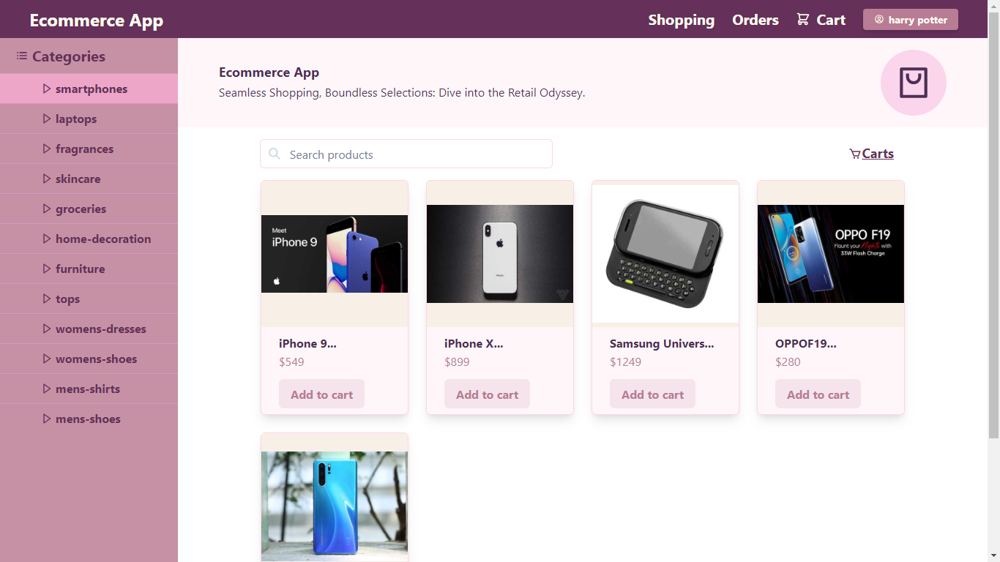
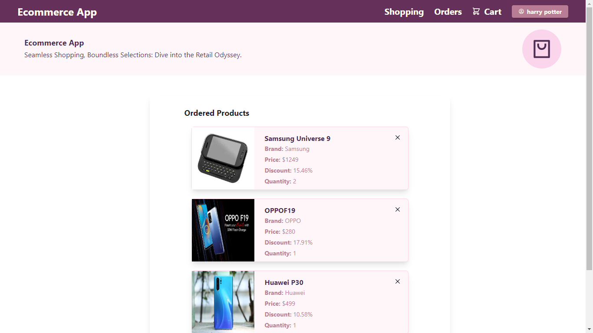
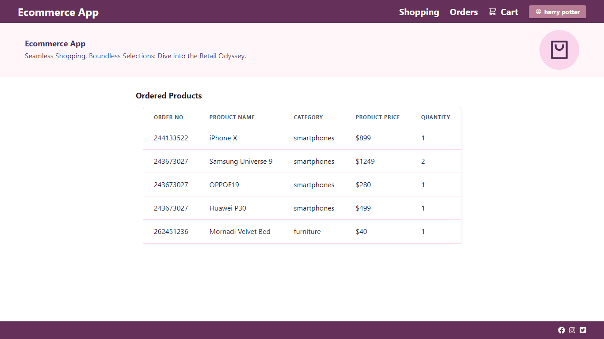

<h1 align="center">
    
</h1>
<h3 align="center">
    <b>Ecommerce app - Easy online shopping</b>
</h3>

## About

<h1></h1>

[Ecommerce app](https://ecommerceapp-personalproject.netlify.app/) is the ecommerce plaform that allows user to find and buy the item of there choice.

## Key Features 🧑‍💻

- Searching and exploring the items
- Adding the items to the cart
- View items according to the category
- View the past orders

## Run Locally (Development Environment) ⚒️

#### Clone the repository and navigate to the project root directory.

Make sure you have [npm and Node.js](https://docs.npmjs.com/downloading-and-installing-node-js-and-npm) installed on your machine.

```bash
# Get packages
$ npm install
```

```bash
# Run the applicaton
$ npm start
```

```bash
# To build apk and ios bundle:
$ npm build
```

## Tech Used 💻

- Frontend : Chakra UI, React.js
- State management : Zustand
- Backend as a Service : dummyJSON

## Screenshots

<div align="center">
  
  
  
</div>

## Contributions

Contributions are highly appreciated. Please send a Pull Request with suggested changes or open an Issue to get things started!
